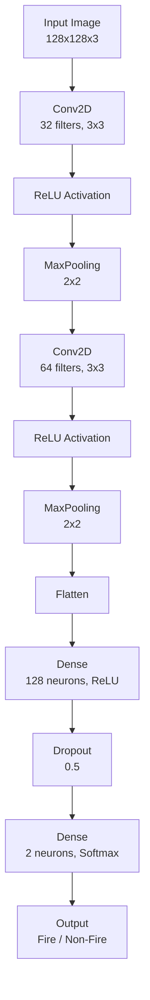

# 🔥 Fire Detection Using 2D CNN

A **Convolutional Neural Network (CNN)** built with **TensorFlow/Keras** to classify images as **fire** or **non-fire**. This project enables early fire detection for applications like forest fire monitoring, surveillance systems, and safety alerts. The model is containerized with Docker for portability and ease of use.

---

## 📌 Features
- ✅ Upload an image and classify it as **fire** or **non-fire**
- ✅ Preprocessing pipeline: Resize to 128x128, normalize, and batch
- ✅ Displays output image with prediction label and bounding box
- ✅ Custom 2D CNN architecture
- ✅ Runs in Google Colab, locally, or via Docker
- ✅ Portable and reproducible with Docker containerization

---

## 🧠 2D CNN Architecture
## 🧠 2D CNN Architecture

- **Activation**: ReLU (hidden layers), Softmax (output layer)
- **Loss Function**: Categorical Crossentropy
- **Optimizer**: Adam

---

## 📊 Workflow
1. **Input**: Upload an image (fire or non-fire)
2. **Preprocessing**: Resize to 128x128, normalize, and batch
3. **Prediction**: Model outputs class probabilities
4. **Output**: Saves image with bounding box and label (`fire` or `non_fire`)

---

## 🛠️ Tech Stack
- Python 3.8+
- TensorFlow/Keras 2.15.0
- NumPy
- Matplotlib
- OpenCV
- Google Colab / Jupyter Notebook (optional for local runs)

